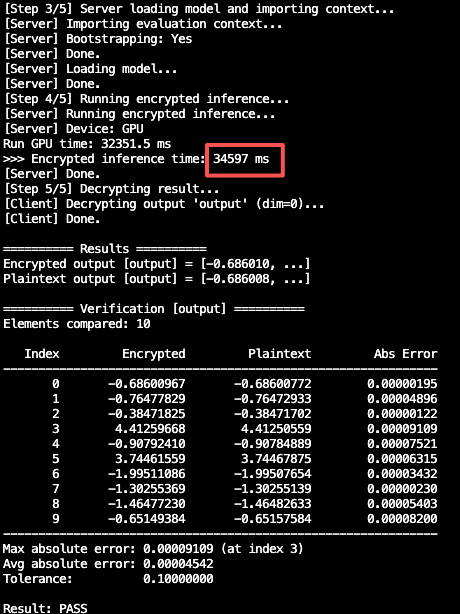

# Description

This directory contains end-to-end encrypted inference examples. Each example requires a `task/` folder containing the adapted model weights, the compiled encrypted computation graph, and the configuration files. We provide prebuilt `task/` folders for all examples except `test_imagenet`, so you can run these examples directly. Alternatively, you can generate these files from scratch by following the [Quick Start](./README.md#quick-start) section below in this document.

# Quick Start

## Build & Install

Refer to the [Build & Install](../../README.md#build--install) section in the root `README` file of the project.

## Code Execution (Using `test_cifar10` as an Example)

For the specific purpose of each step, refer to the [Quick Start](../../README.md#quick-start) section in the root `README` file. Only the relevant commands are listed below. In particular, please note:
- To test on the MNIST or ImageNet datasets, simply replace `test_cifar10` with `test_mnist` or `test_imagenet`, respectively.
- The `vgg.py` file defines four models: VGG11, VGG13, VGG16, and VGG19. You can choose whichever model best suits your needs.

### Baseline Training

```bash
python examples/vgg_demo/test_cifar10/train_vgg.py --epochs 150 --batch-size 128 --lr 0.1 --output-dir ./runs/vgg_demo/cifar10/model --input-shape 3 32 32
```

> Note: the input shape for the MNIST dataset must be `1 32 32`, not `1 16 16`.

The best accuracy is **90.79%**.

```text
[140/150] lr=0.0100  train 0.0753/97.42%  test 0.3876/89.10%    12.4s
[141/150] lr=0.0100  train 0.0767/97.36%  test 0.3665/89.57%    11.8s
[142/150] lr=0.0100  train 0.0707/97.61%  test 0.3548/89.84%    12.3s
[143/150] lr=0.0100  train 0.0726/97.52%  test 0.4004/89.00%    11.8s
[144/150] lr=0.0100  train 0.0793/97.26%  test 0.3654/89.75%    12.1s
[145/150] lr=0.0100  train 0.0714/97.64%  test 0.4097/88.99%    12.2s
[146/150] lr=0.0100  train 0.0747/97.32%  test 0.4028/88.89%    11.8s
[147/150] lr=0.0100  train 0.0720/97.47%  test 0.3933/88.66%    11.8s
[148/150] lr=0.0100  train 0.0789/97.19%  test 0.4451/88.07%    12.7s
[149/150] lr=0.0100  train 0.0760/97.36%  test 0.3827/89.08%    12.3s
[150/150] lr=0.0010  train 0.0812/97.12%  test 0.4141/88.78%    12.2s
Best accuracy: 90.79%  ->  ./runs/cifar10/model/train_vgg_baseline.pth
```

### Operator Replacement and Model Fine-Tuning

```bash
python examples/vgg_demo/test_cifar10/train_vgg.py \
  --poly_model_convert \
  --pretrained ./runs/vgg_demo/cifar10/model/train_vgg_baseline.pth \
  --epochs 10 \
  --batch-size 36 \
  --lr 0.001 \
  --input-dir ./runs/vgg_demo/cifar10/model \
  --export-dir ./runs/vgg_demo/cifar10/task/server \
  --input-shape 3 32 32 \
  --degree 2 \
  --upper-bound 3.0 \
  --poly-module RangeNormPoly2d
```

The best accuracy is **81.00%**.

```text
[  5/10] lr=0.0010  train 0.3807/87.13%  test nan/80.04% *  25.1s
[  6/10] lr=0.0010  train 0.3563/88.00%  test nan/79.45%    25.0s
[  7/10] lr=0.0010  train 0.3354/88.59%  test nan/79.39%    25.2s
[  8/10] lr=0.0010  train 0.3187/89.19%  test nan/79.82%    27.9s
[  9/10] lr=0.0010  train 0.2971/89.73%  test nan/81.00% *  24.6s
[ 10/10] lr=0.0010  train 0.2849/90.22%  test nan/80.44%    23.3s
Best accuracy: 81.00%  ->  ./runs/cifar10/model/train_poly.pth
```

### FHE Compilation

```bash
python training/run_compile.py \
  --input=./runs/vgg_demo/cifar10/model/trained_poly.onnx \
  --output=./runs/vgg_demo/cifar10/ \
  --style=multiplexed
```

### Generate Low-Level Instructions

```bash
python inference/interface/gen_mega_ag.py --task-dir ./runs/vgg_demo/cifar10/task
```

### Inference on CPU or GPU

```bash
./build/examples/inference --task-dir ./runs/vgg_demo/cifar10/task --input ./examples/vgg_demo/test_cifar10/task/client/img.csv --verify
./build/examples/inference --task-dir ./runs/vgg_demo/cifar10/task --input ./examples/vgg_demo/test_cifar10/task/client/img.csv --gpu --verify
```

Inference results:



# Issue Record

After enabling `--poly_model_convert`, the error `TypeError: only 0-dimensional arrays can be converted to Python scalars` occurs in the Hermite coefficient calculation stage, with the call stack:

- [`replace_activation_with_poly()`](../../training/nn_tools/replace.py:50)
- [`get_hermite_coeffs_for_module()`](../../training/nn_tools/eval_fn_hat_for_aespa.py:166)
- [`compute_coefficients()`](../../training/nn_tools/eval_fn_hat_for_aespa.py:84)
- [`quad()`](../../training/nn_tools/eval_fn_hat_for_aespa.py:110)

**Reason**：`scipy.integrate.quad` requires the integrand to be a function of the form “scalar input -> scalar output”, but in the current implementation:

- [`numpy_func()`](../../training/nn_tools/eval_fn_hat_for_aespa.py:185) may return an array of shape=(1,) (see the [`return result.numpy()`](../../training/nn_tools/eval_fn_hat_for_aespa.py:189)).
- `quad` [lambda](../../training/nn_tools/eval_fn_hat_for_aespa.py:111) explicitly wraps `np.array(...)` resulting in a numpy `ndarray` instead of a Python float.

## Suggestions for Fixing the Issue

1. **Ensure the integrand returns a scalar** (core).
   - In [`compute_coefficients()`](../../training/nn_tools/eval_fn_hat_for_aespa.py:84), ensure `quad` finally `return float(...)`.
   - Do not use [`quad`](../../training/nn_tools/eval_fn_hat_for_aespa.py:110) [call site](../../training/nn_tools/eval_fn_hat_for_aespa.py:110) to wrap `np.array(...)` in the return value.
2. **Ensure** `numpy_func` returns a scalar when input is a scalar
   - In [`numpy_func()`](../../training/nn_tools/eval_fn_hat_for_aespa.py:185) check if the input is a scalar.
   - Scalar input returns `float`; array input returns `ndarray`.
3. **Optional enhancement: `compute_coefficients`**. After doing `np.asarray(fx)`, if `size == 1`, convert to `float`.

## Reference Fixing the Issue (Pseudo-Code)

```python
# training/nn_tools/eval_fn_hat_for_aespa.py

def numpy_func(x):
    is_scalar = np.isscalar(x)
    x_arr = np.array([x], dtype=np.float64) if is_scalar else np.asarray(x, dtype=np.float64)
    with torch.no_grad():
        y = module(torch.as_tensor(x_arr, dtype=torch.float64)).cpu().numpy()
    if is_scalar:
        return float(np.asarray(y).reshape(-1)[0])
    return y


def integrand_scalar(x):
    fx = func(x, **func_kwargs) if func_kwargs else func(x)
    return float(fx * hermite_prob(n, x) * np.exp(-(x**2) / 2))

I_n, _ = quad(integrand_scalar, -limit, limit, epsabs=tol, limit=1000)
```

